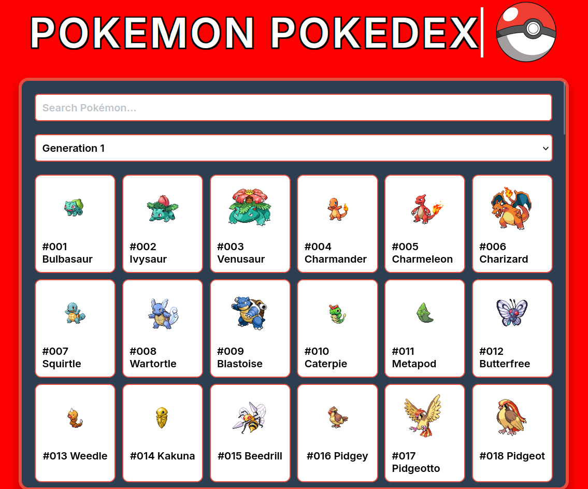

# Pokédex Web App

A simple Pokédex built with HTML, CSS, and JavaScript and data fetched from PokeAPI — max nostalgia with Gen 5 pixel sprites straight from the video games!

## Features

-  Search Pokémon by name, sorted by generation.
-  Displays abilities, types, stats, and more
-  Responsive UI, click on Pokeball icon to load.
-  Nostalgic 5th generation pixel sprites.
-  Pulls data from the [PokéAPI](https://pokeapi.co)

## Glance

 <!-- Add a screenshot if you have one -->

## Tech Stack

- HTML5
- CSS3 (animations + custom styling)
- Vanilla JavaScript
- PokéAPI (for data)

## Setup

1. Clone this repo:

   ```bash
   git clone https://github.com/yourusername/pokedex.git
   cd pokedex
